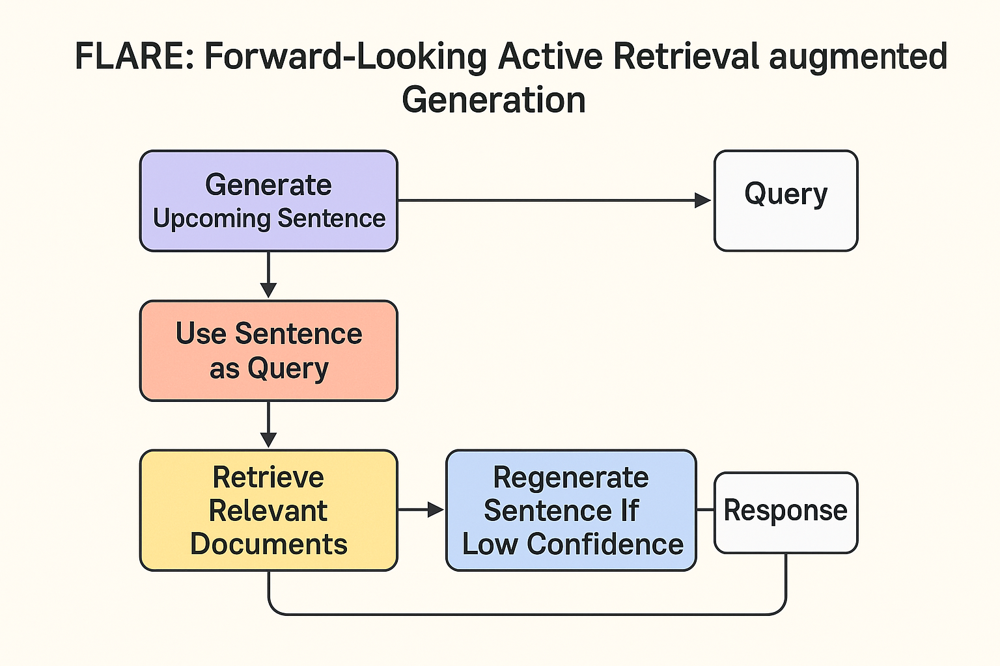

# 🌟 FLARE: لما الذكاء الاصطناعي بقى بيفكر قبل ما يجاوب 😎

الـ **FLARE** هو طريقة ذكية جديدة في عالم الـ AI،  
بتحاول تزود دقة الموديلات الكبيرة زي ChatGPT،  
عن طريق إنها **تسحب معلومات من مصادر خارجية وهي شغالة** مش قبل ما ترد وبس 🔥  

---

## 💭 يعني إيه FLARE؟

الكلمة دي اختصار لـ **Forward-Looking Active Retrieval augmented generation**،  
وده معناه ببساطة إن الموديل ما بيستناش السؤال وبعدين يجاوب من دماغه…  
ده **بيفكر لقدّام**، وبيعرف إمتى يحتاج يدور على معلومة، ويدور على إيه بالظبط.  
النتيجة؟ أداء أحسن بكتير في المهام الطويلة والمعتمدة على معرفة كبيرة 💪  

---

## 🔍 مشاكل الطرق القديمة (Single-Retrieval)

- النماذج دي ساعات بتخرف 😂 وبتطلع كلام مش دقيق.  
- بتعمل بحث مرة واحدة بس في الأول، وده بيكفيش لما الجواب طويل.  
- ما بتعرفش تجمع معلومات جديدة وهي بتكتب، فبتبدأ تهرتل بعد شوية 😅  

  

---

## ✨ FLARE بيحلها إزاي؟

الـ FLARE بيشتغل بخطوات متكررة كده:

1. الموديل بيتوقع الجملة الجاية اللي المفروض يكتبها.  
2. يستخدم الجملة دي كـ **query** يدور بيه على معلومات من برّه.  
3. لو لقى إن الجملة فيها كلمات مش واثق منها،  
   بيرجع يكتبها من الأول بعد ما يجيب المعلومة الصح.  
4. ويفضل يعمل كده خطوة بخطوة لحد ما يخلص الرد كله 🌀  

  

---

## 🎯 نسختين من FLARE

1. **FLAREinstruct** ← بتشجع الموديل يسأل ويسترجع معلومات لما يحس إنه محتاج.  
2. **FLAREdirect** ← بياخد الجملة اللي كتبها فعلاً ويستخدمها كـ query لو فيها شك.  

  

---

## 🔎 الاسترجاع حسب الثقة (Confidence-Based Retrieval)

الـ FLARE مش بيستهلك موارد على الفاضي،  
هو بيسترجع بس لما الموديل فعلاً **حاسس إنه مش واثق**.  
وبيقدر يصيغ السؤال بطريقتين:

- **implicit**: يخفيه في جملة ناقصة.  
- **explicit**: يكتبه كسؤال مباشر.

---

## ⚙️ كود التنفيذ - FLAREInstructQueryEngine

الكود ده بينفذ فكرة FLARE عمليًا جوه مشروع [LlamaIndex](https://github.com/run-llama/llama_index/blob/main/llama-index-core/llama_index/core/query_engine/flare/base.py).  
وهو بيجمع بين البحث والتوليد عشان يطلع رد دقيق مبني على تعليمات ذكية.

---

## 🧩 الباراميترات اللي محتاج تعرفها

- `query_engine`: النظام اللي بيعمل الاسترجاع.  
- `llm`: الموديل اللي بيولد الإجابات.  
- `instruct_prompt`: الـ template اللي بيولّد التعليمات.  
- `lookahead_answer_inserter`: الجزء اللي بيضيف إجابات مبدئية.  
- `done_output_parser`: اللي بيحدد إمتى الرد خلص.  
- `query_task_output_parser`: اللي بيستخرج المهام الفرعية.  
- `max_iterations`: أقصى عدد تكرارات للتوليد.  
- `max_lookahead_query_tasks`: أقصى عدد استعلامات مستقبلية.

---

## 🔧 إزاي بيشتغل من جوا (Under the hood)

السر كله في إن الموديل **ما بيجاوبش كله مرة واحدة**،  
لكن بيقسم الإجابة لمراحل صغيرة وفيها فراغات (placeholders).  
كل مرة بيحاول يملأ الفراغات دي بمعلومات جديدة من قاعدة المعرفة.

### الخطوات:

1. المستخدم يسأل سؤال.  
2. الموديل يولد رد مبدئي فيه فراغات.  
3. يحدد الأسئلة الفرعية اللي محتاجة بحث.  
4. يبعتها لمحرك البحث الداخلي.  
5. يرجع يحط المعلومات مكان الفراغات.  
6. يحدث الإجابة.  
7. يكرر العملية دي كذا مرة لحد ما يطلع الرد النهائي بدقة عالية ✨  

  

---

## 🧠 الخلاصة

**FLARE مش مجرد RAG عادي، ده RAG عنده بعد نظر!**  

يعني الموديل بقى مش بس بيرد، ده كمان بيفكر، يشك، ويدور عشان يتأكد.  
وده اللي مخليه من أذكى الاتجاهات البحثية في الذكاء الاصطناعي دلوقتي 😎  

